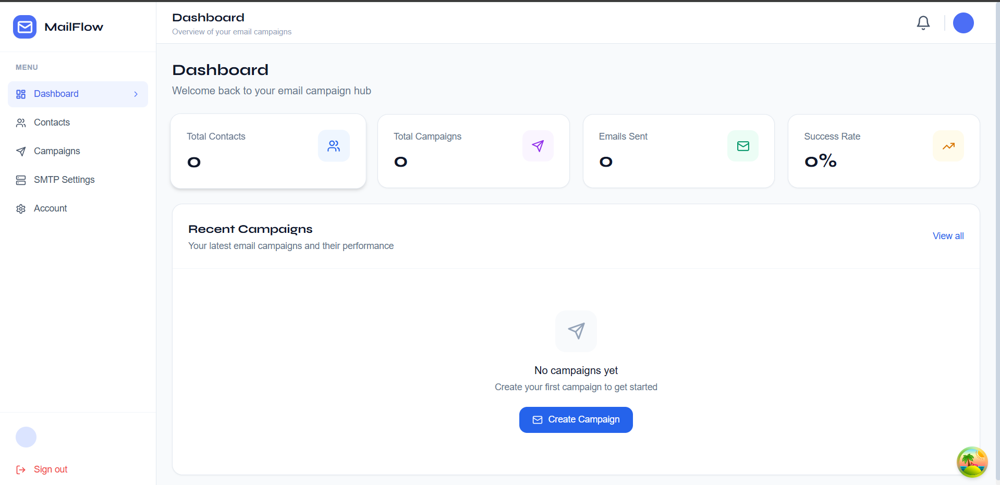
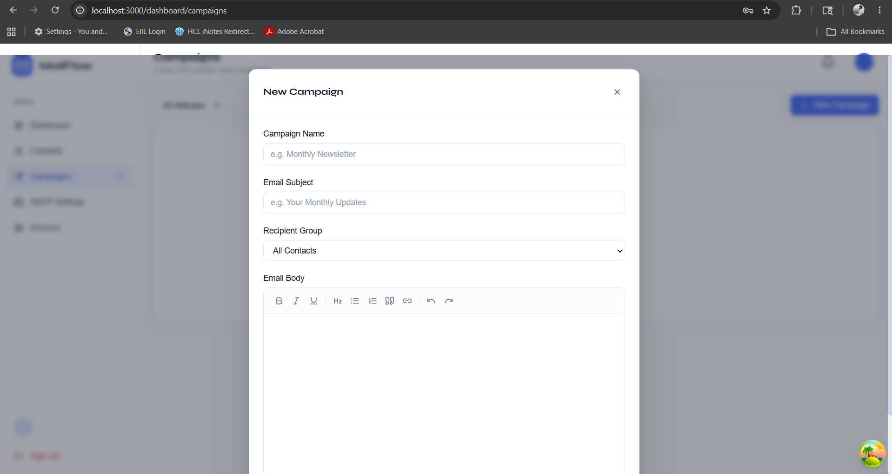
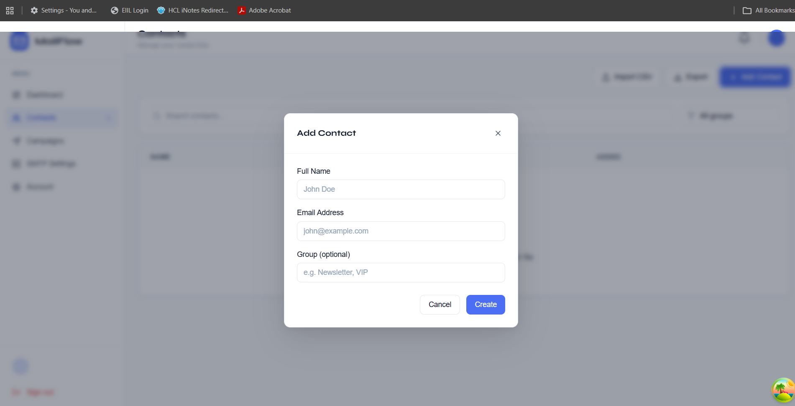
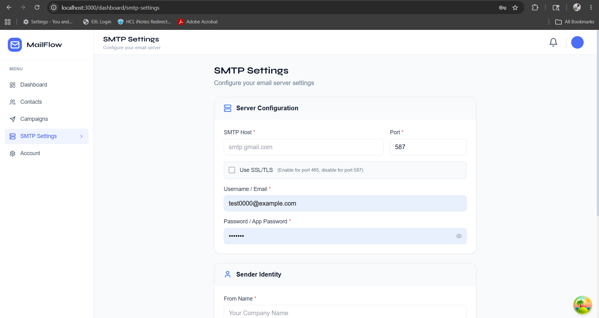

# MailFlow — Bulk Email Sender

<div align="center">
  
  <p><em>Professional bulk email sending platform with campaign management and analytics</em></p>
</div>

## 📋 Overview

MailFlow is a full-stack bulk email sending application that allows users to manage contacts, create email campaigns with a rich text editor, configure SMTP settings, and track email delivery. Built with **Next.js 14** (frontend) and **Hono** (backend).

### Features

- 🔐 **Authentication** — Secure login/registration with session management
- 📇 **Contact Management** — CRUD operations, group management, CSV import/export
- 📧 **Campaign Management** — Create, edit, send, and track email campaigns
- ✨ **Rich Text Editor** — WYSIWYG editor for crafting beautiful emails
- ⚙️ **SMTP Configuration** — Configure any SMTP server, test connection
- 📊 **Dashboard** — Real-time statistics and campaign performance
- 🎨 **Modern UI** — Responsive design with Tailwind CSS

## 📸 Screenshots

| Dashboard | Campaigns | Contacts |
|-----------|-----------|----------|
|  |  |  |

| SMTP Settings | Email Editor |
|---------------|--------------|
|  | Rich text email composer |

## 📁 Project Structure
MailFlow/
├── frontend/ # Next.js 14 frontend
│ ├── app/ # App Router pages
│ │ ├── layout.tsx # Root layout with providers
│ │ ├── page.tsx # Landing/redirect page
│ │ ├── login/page.tsx # Login page
│ │ ├── register/page.tsx # Registration page
│ │ └── dashboard/ # Protected routes
│ │ ├── layout.tsx # Dashboard layout (sidebar)
│ │ ├── page.tsx # Dashboard home
│ │ ├── contacts/ # Contact management
│ │ ├── campaigns/ # Campaign management
│ │ └── settings/ # SMTP & user settings
│ ├── components/ # Reusable components
│ │ ├── layout/ # Sidebar, TopBar
│ │ └── email/ # RichEditor component
│ ├── lib/ # Utilities
│ │ ├── api.ts # API client
│ │ ├── auth-context.tsx # Authentication context
│ │ ├── validations.ts # Zod schemas
│ │ └── utils.ts # Helper functions
│ ├── types/ # TypeScript definitions
│ ├── public/ # Static assets
│ └── package.json
│
├── backend/ # Hono backend API
│ ├── src/
│ │ ├── app.ts # Main application
│ │ ├── middleware/ # Auth middleware
│ │ ├── routes/ # API routes
│ │ │ ├── auth.ts # Authentication endpoints
│ │ │ ├── contacts.ts # Contact management
│ │ │ ├── campaigns.ts # Campaign endpoints
│ │ │ ├── config.ts # SMTP configuration
│ │ │ └── dashboard.ts # Statistics
│ │ ├── services/ # Business logic
│ │ │ ├── userDatabase.ts
│ │ │ ├── emailService.ts
│ │ │ └── notificationService.ts
│ │ └── types.ts # Type definitions
│ ├── data/ # SQLite database files
│ ├── .env # Environment variables
│ └── package.json
│
├── screenshots/ # Application screenshots
│ ├── s1.png # Dashboard
│ ├── s2.png # Campaigns
│ ├── s3.png # Contacts
│ └── s4.png # SMTP Settings
│
└── README.md # This file


## 🚀 Quick Start

### Prerequisites

- Node.js 18+ or Bun 1.0+
- npm or yarn package manager
- Gmail account (for SMTP) or any SMTP provider

### Installation

#### 1. Clone and Setup Backend

```bash
# Clone the repository
git clone <your-repo-url>
cd MailFlow/backend

# Install dependencies
npm install

# Create environment file
cp .env.example .env

# Edit .env with your configuration
# Required: SESSION_SECRET, SMTP settings (optional)
env.example:

env
PORT=8080
CORS_ORIGIN=http://localhost:3000
SESSION_SECRET=your-super-secret-key-min-32-chars
NODE_ENV=development

# SMTP Configuration (optional - users can configure their own)
SMTP_HOST=smtp.gmail.com
SMTP_PORT=587
SMTP_SECURE=false
SMTP_USER=your-email@gmail.com
SMTP_PASS=your-app-password
FROM_EMAIL=noreply@yourdomain.com
FROM_NAME=MailFlow
2. Setup Frontend
bash
cd ../frontend

# Install dependencies
npm install

# Copy environment file
cp .env.example .env.local
.env.local:

env
NEXT_PUBLIC_API_URL=http://localhost:8080
Running the Application
Terminal 1 - Backend (port 8080)
bash
cd backend
npm run dev
Terminal 2 - Frontend (port 3000)
bash
cd frontend
npm run dev
Access the Application
Frontend: http://localhost:3000

Backend API: http://localhost:8080

Health Check: http://localhost:8080/health

🔧 Configuration
SMTP Setup (for Gmail)
Enable 2-Step Verification on your Google Account

Generate App Password:

Go to https://myaccount.google.com/apppasswords

Select app: "Mail"

Select device: "Windows Computer"

Copy the 16-character password

Enable IMAP in Gmail Settings → Forwarding and POP/IMAP

SMTP Settings in App
After logging in, go to Settings → SMTP Settings and configure:

Field	Value
SMTP Host	smtp.gmail.com
Port	587 (or 465 with SSL)
Use SSL/TLS	Uncheck for 587, Check for 465
Username	Your full Gmail address
Password	The 16-character App Password
From Name	Your display name
From Email	Your Gmail address
🛠 Tech Stack
Frontend
Technology	Purpose
Next.js 14	React framework with App Router
TypeScript	Type safety
Tailwind CSS	Styling
TanStack Query	Server state management
React Hook Form	Form handling
Zod	Schema validation
Tiptap	Rich text editor
Lucide React	Icons
Backend
Technology	Purpose
Hono	Lightweight HTTP framework
better-sqlite3	SQLite database
Argon2	Password hashing
Nodemailer	Email sending
Zod	Request validation
📡 API Endpoints
All endpoints are prefixed with /api.

Authentication
Method	Endpoint	Description
POST	/auth/register	Create new account
POST	/auth/login	Login with email/password
POST	/auth/logout	Logout user
GET	/user/info	Get current user
Contacts
Method	Endpoint	Description
GET	/contacts	List contacts (paginated)
GET	/contacts/groups	List contact groups
POST	/contacts	Create contact
PUT	/contacts/:id	Update contact
DELETE	/contacts/:id	Delete contact
Campaigns
Method	Endpoint	Description
GET	/campaigns	List campaigns
GET	/campaigns/:id	Get campaign details
POST	/campaigns	Create campaign
PUT	/campaigns/:id	Update campaign
DELETE	/campaigns/:id	Delete campaign
POST	/campaigns/:id/send	Send campaign
POST	/campaigns/:id/test	Send test email
SMTP Configuration
Method	Endpoint	Description
GET	/config/smtp	Get SMTP config
POST	/config/smtp	Save SMTP config
POST	/config/smtp/test	Test connection
Dashboard
Method	Endpoint	Description
GET	/dashboard/stats	Get statistics
🎯 Usage Guide
1. Create an Account
Navigate to http://localhost:3000/register

Fill in your details and create an account

2. Configure SMTP (Required for sending emails)
Go to Settings → SMTP Settings

Enter your SMTP credentials

Click "Save Settings"

Send a test email to verify

3. Add Contacts
Go to Contacts page

Add contacts manually or import CSV

Create contact groups for organization

4. Create Campaign
Go to Campaigns → New Campaign

Write your email content using the rich text editor

Select recipient group

Save as draft or schedule for later

5. Send Campaign
Go to Campaigns list

Click "Send" on your campaign

Choose recipient group

Confirm and send

🔒 Security Features
Password Hashing: Argon2 for secure password storage

Session Management: Signed tokens with expiration

Input Validation: Zod schemas on all endpoints

CORS Protection: Configured for frontend origin only

SQL Injection Prevention: Parameterized queries

📦 Build for Production
Backend
bash
cd backend
npm run build
npm start
Frontend
bash
cd frontend
npm run build
npm start
🐛 Troubleshooting
Common Issues
Issue	Solution
Backend won't start	Check if port 8080 is free, change PORT in .env
Frontend can't connect	Verify backend is running on port 8080
SMTP connection fails	Use App Password for Gmail, enable IMAP
401 Unauthorized	Clear cookies and login again
Database errors	Delete data/ folder and restart
Gmail SMTP Troubleshooting
Enable IMAP in Gmail settings

Generate App Password (not regular password)

Visit https://accounts.google.com/DisplayUnlockCaptcha

Try port 465 with SSL if 587 fails

📄 License
This project is built for the Full Stack Developer Assignment.

👨‍💻 Author
Built with ❤️ using Next.js and Hono

Quick Commands Reference
bash
# Backend
cd backend
npm install          # Install dependencies
npm run dev          # Start development server
npm run build        # Build for production
npm start            # Run production server

# Frontend
cd frontend
npm install          # Install dependencies
npm run dev          # Start development server
npm run build        # Build for production
npm start            # Run production server
npm run type-check   # Run TypeScript checks
npm run lint         # Run ESLint